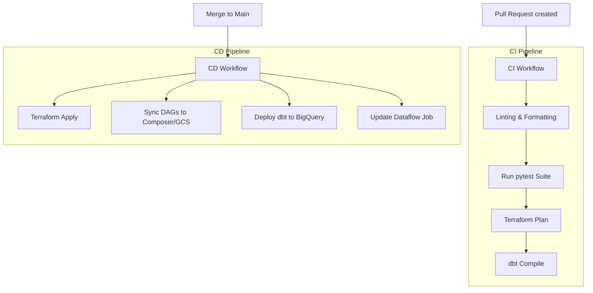

# CI/CD Workflows (GitHub Actions)

## Purpose

The `.github/workflows` directory defines the Continuous Integration and Continuous Deployment (CI/CD) pipelines for the enterprise platform. Using GitHub Actions, these YAML configurations automate the software development lifecycle, ensuring that code is tested, validated, and safely deployed to GCP environments in a repeatable and trackable manner.

These workflows enforce quality gates and automate the deployment of Infrastructure (Terraform), Pipelines (Dataflow), and Orchestration (Composer DAGs).

## Architecture

## Files

- `ci.yml`: Triggered on pull requests. Runs linters, the `pytest` suite, and generates a dry-run execution plan for Terraform to catch errors early.
- `cd-infrastructure.yml`: Triggered on merges to main. Securely applies Terraform state changes to GCP.
- `cd-pipelines.yml`: Triggers deployments for code changes. Updates Dataflow jobs, syncs new DAGs to the Composer bucket, and deploys dbt models.

## Configuration

Workflows rely heavily on GitHub Repository Secrets for secure authentication to GCP.
- `GCP_CREDENTIALS`: A Workload Identity Federation configuration (preferred) or JSON service account key.
- Branch protection rules are enforced via GitHub repo settings, requiring the `ci.yml` workflow to pass before merging.

## How It Works

1. **Trigger**: Developer pushes code or creates a Pull Request.
2. **Runner Initialization**: GitHub spins up an isolated Ubuntu runner.
3. **Checkout & Setup**: Actions check out the code, install Python, Terraform, and configure GCP authentication using stored secrets.
4. **Execution (CI)**: Runs `pytest` and `terraform plan`. Results are often commented back to the PR for reviewer visibility.
5. **Execution (CD)**: Upon approval and merge, the CD pipeline executes `terraform apply`, copies Python files using `gsutil`, or triggers Dataflow pipeline updates using the `gcloud` CLI.

## Dependencies

- **GitHub Actions**: Execution environment.
- **Google Cloud Auth Action**: `google-github-actions/auth` for secure, keyless authentication via Workload Identity Federation.
- **Setup-Terraform Action**: HashiCorp's official action for Terraform CLI installation.

## Commands

*Workflows execute automatically based on GitHub event triggers (push, pull_request). No local CLI commands required, although `act` can be used for local testing.*

## Integration Points

- **Global Control**: Interacts with every other directory in the repository. It tests code in `tests/`, deploys `infrastructure/`, runs pipelines from `streaming_pipeline/` and `batch_pipeline/`, and updates `airflow_dags/`.
