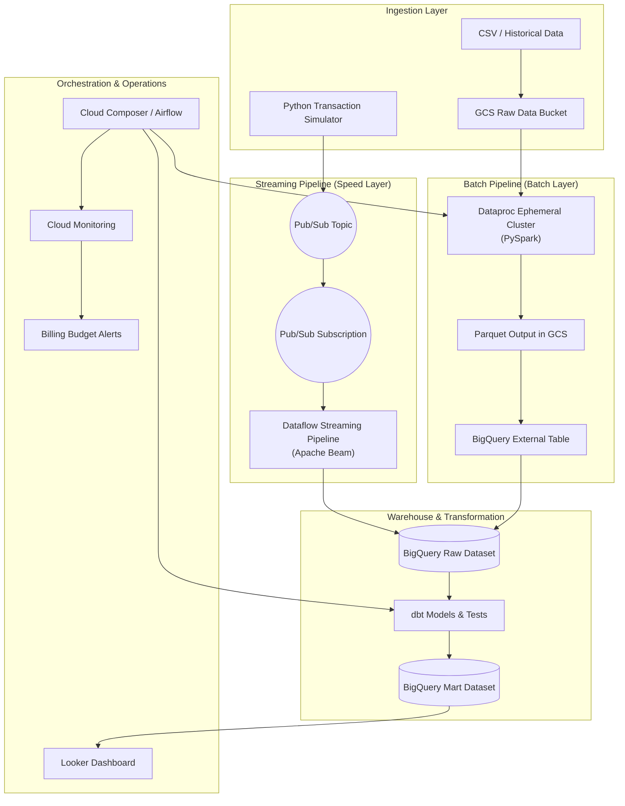

<div align="center">

# 🛡️ Enterprise GCP Fraud Detection Platform

**A Production-Grade Lambda Architecture for Financial Transaction Security**

[](https://rishikeshdataeng.netlify.app/)
[](https://cloud.google.com/)
[](https://www.terraform.io/)
[](https://beam.apache.org/)
[](https://www.getdbt.com/)
[](https://cloud.google.com/looker)

</div>

---

## 📌 Executive Summary

This repository contains the complete infrastructure, pipelines, orchestration, analytics, monitoring, and documentation for a **Fraud Detection Data Engineering Platform** built on **Google Cloud Platform (GCP)**.

The solution implements a **Lambda Architecture** that processes financial transaction data through two complementary paths:

- **Real-time streaming** for sub-second fraud signal ingestion and processing
- **Batch processing** for large historical datasets and deep analytics

The platform is designed to demonstrate end-to-end enterprise data engineering practices including:

- Infrastructure as Code with **Terraform**
- Streaming ingestion with **Pub/Sub + Dataflow + Apache Beam**
- Batch ingestion with **Dataproc + PySpark**
- Warehouse modeling with **BigQuery**
- Transformation and tests with **dbt**
- Workflow orchestration with **Cloud Composer**
- Observability with **Cloud Monitoring**
- Dashboarding with **Looker**
- Cost visibility and control with **Budget Alerts / FinOps**
- Technical documentation with a **live interactive portal**

---

## 🌐 Live Project Documentation

Explore the interactive project portal for the complete architecture, lifecycle, troubleshooting history, and interview-friendly explanation of the platform:

**🔗 https://rishikeshdataeng.netlify.app/**

This portal is intended to help with:

- project walkthroughs
- technical interviews
- architecture reviews
- handover documentation
- engineering decision tracking
- operational troubleshooting

---

## 🏗️ End-to-End Enterprise Architecture



---

## 🧱 Repository Blueprint & Tech Stack

The repository is organized by deployment and processing concern:

| Module | Tech Stack | Purpose |
|---|---|---|
| [`/infrastructure`](./infrastructure) | Terraform, GCP APIs | Declarative provisioning of infrastructure, IAM, storage, Pub/Sub, and BigQuery |
| [`/data_generator`](./data_generator) | Python 3, Faker, Pub/Sub client | Synthetic transaction simulator |
| [`/streaming_pipeline`](./streaming_pipeline) | Apache Beam, Dataflow | Real-time transaction processing and PII masking |
| [`/batch_pipeline`](./batch_pipeline) | PySpark, Dataproc | Large-scale historical CSV processing |
| [`/dbt_fraud`](./dbt_fraud) | dbt Core, SQL | Analytics engineering, staging, marts, and tests |
| [`/airflow_dags`](./airflow_dags) | Apache Airflow, Cloud Composer | Workflow orchestration and automation |
| Documentation Portal | HTML, CSS, JS | Interactive project lifecycle, flow diagrams, and evidence mapping |

---

## 🔁 Master Project Lifecycle

This project is documented as an end-to-end engineering lifecycle:

1. **Google Cloud project setup**
2. **Billing and budget configuration**
3. **IAM and service account design**
4. **Terraform infrastructure provisioning**
5. **Raw storage and messaging setup**
6. **Historical batch ingestion**
7. **Real-time streaming ingestion**
8. **Warehouse modeling and transformation**
9. **Workflow orchestration**
10. **Monitoring and alerting**
11. **BI / dashboarding**
12. **FinOps and optimization**
13. **Troubleshooting and fixes**
14. **Interview and handover readiness**

---

## 📁 Repository Structure

```text
gcp-fraud-detection-engine/
├── airflow_dags/
├── batch_pipeline/
├── data_generator/
├── dbt_fraud/
├── infrastructure/
├── streaming_pipeline/
├── README.md
└── ...
```

### Key folders

- **`airflow_dags/`**: Airflow DAGs for batch orchestration
- **`batch_pipeline/`**: Dataproc PySpark jobs
- **`data_generator/`**: Synthetic transaction generation
- **`dbt_fraud/`**: dbt transformations and tests
- **`infrastructure/`**: Terraform modules and GCP provisioning
- **`streaming_pipeline/`**: Dataflow / Beam streaming pipeline

---

## 🚀 Core Components

### 1) Transaction Generator
Creates realistic synthetic financial transactions and publishes them to Pub/Sub in streaming mode or writes CSV in batch mode.

### 2) Pub/Sub
Buffers real-time transaction events and decouples producers from consumers.

### 3) Dataflow
Processes streaming events, applies schema validation and masking, and writes cleansed records into BigQuery.

### 4) Dataproc
Runs the batch PySpark job on an ephemeral cluster to process historical CSV data and write Parquet to GCS.

### 5) BigQuery
Acts as the analytical warehouse for raw, staging, and mart data.

### 6) dbt
Transforms raw warehouse data into analytics-ready models, documentation, and tests.

### 7) Cloud Composer
Coordinates batch orchestration and operational workflow execution.

### 8) Monitoring & FinOps
Tracks failures, backlog, worker usage, storage growth, and budget thresholds.

---

## ⚙️ Deployment Guide

> Adjust commands to your environment and branch setup.

### 1. Authenticate

```bash
gcloud auth application-default login
gcloud config set project fraud-detection-de-project
```

### 2. Provision Infrastructure

```bash
cd infrastructure
terraform init
terraform plan
terraform apply
```

### 3. Prepare Data Generator

```bash
cd data_generator
python3 transaction_generator.py --help
```

### 4. Start Streaming Generator

```bash
python3 transaction_generator.py \
  --mode stream \
  --rate 100 \
  --total 50000
```

### 5. Run Batch Processing

```bash
cd batch_pipeline
python3 batch_fraud_pipeline.py
```

### 6. Validate BigQuery

```bash
bq query --use_legacy_sql=false '
SELECT COUNT(*) AS total_rows
FROM `fraud-detection-de-project.fraud_raw_dev.raw_streaming_transactions`'
```

### 7. Run dbt

```bash
cd dbt_fraud
dbt debug
dbt parse
dbt test
dbt run
```

### 8. Trigger Orchestration

Use Cloud Composer / Airflow DAGs to automate cluster creation, job execution, and cleanup.

---

## 🛡️ Security & Compliance

- **PII Masking**: Sensitive columns are masked using SHA-256 before landing in warehouse tables.
- **Least Privilege IAM**: Dedicated service accounts and scoped roles are used for ingestion and orchestration.
- **Separation of Duties**: Infrastructure, ingestion, transformation, and visualization are split into different modules.
- **Budget Control**: Billing alerts and budget thresholds provide early warning on cost growth.
- **Data Quality**: dbt tests enforce not-null, uniqueness, and accepted-value constraints where applicable.

---

## 📊 Monitoring & Observability

The platform includes observability across ingestion, processing, and warehouse layers:

- **Dataflow**: failure alerts, worker capacity, backlog / unacked message tracking
- **Dataproc**: job visibility and runtime status
- **BigQuery**: storage growth and query behavior monitoring
- **Composer**: scheduler health checks
- **Budgets**: threshold-based cost alerts

---

## 📈 Analytics & Reporting

The final curated layer is intended for analytics and business reporting in **Looker**.

Typical business questions supported by the mart layer include:

- transaction volume trends
- fraud-band distribution
- suspicious transaction patterns
- geographic concentration
- transaction-type breakdowns
- high-risk transaction summaries

---

## 🧪 Data Quality & Validation

The project validates the data at multiple points:

- schema enforcement
- null checks
- deduplication
- masked-column verification
- fraud-band checks
- transaction-type normalization
- table count validation
- output schema verification

---

## 🚨 Troubleshooting & Lessons Learned

This project included real debugging and iterative fixes, including:

- schema mismatch between generator, pipeline, and warehouse
- external table definition mismatches
- path and command mistakes in Cloud Shell
- Composer environment and DAG upload issues
- monitoring metric name changes in the current GCP UI
- Dataproc job runtime and validation overhead
- dbt project / branch synchronization issues

These are documented in the interactive portal for interview readiness and future maintenance.

---

## 🔍 Why This Project Is Valuable

This project demonstrates:

- real-world GCP architecture
- batch and streaming design
- production-style data engineering patterns
- IaC-based provisioning
- orchestration and monitoring
- warehouse modeling
- documentation and operational maturity
- interview-friendly architecture storytelling

---

## 🗺️ Suggested Interview Walkthrough

A clean interview explanation for this project is:

1. Create the GCP project and set billing / IAM
2. Provision infrastructure using Terraform
3. Generate synthetic data
4. Send real-time events through Pub/Sub
5. Process events with Dataflow
6. Run historical batch processing in Dataproc
7. Store data in BigQuery
8. Transform data with dbt
9. Orchestrate workflows using Composer
10. Monitor failures and cost
11. Visualize results in Looker
12. Use the portal for traceability and handover

---

## 🔮 Future Roadmap

Potential future enhancements:

- complete Looker dashboard polish
- CI/CD pipeline for Terraform and dbt
- fully automated Composer-triggered end-to-end workflow
- stronger data quality contracts
- semantic layer / metrics layer
- additional alert policies
- cost anomaly detection
- more detailed incident timeline in the portal

---

## 👤 Author

**Rishikesh Yadav**

- Data Engineering / GCP Fraud Detection Platform
- Live Documentation: https://rishikeshdataeng.netlify.app/

---

## 📄 License

This project is intended for educational and portfolio use.
