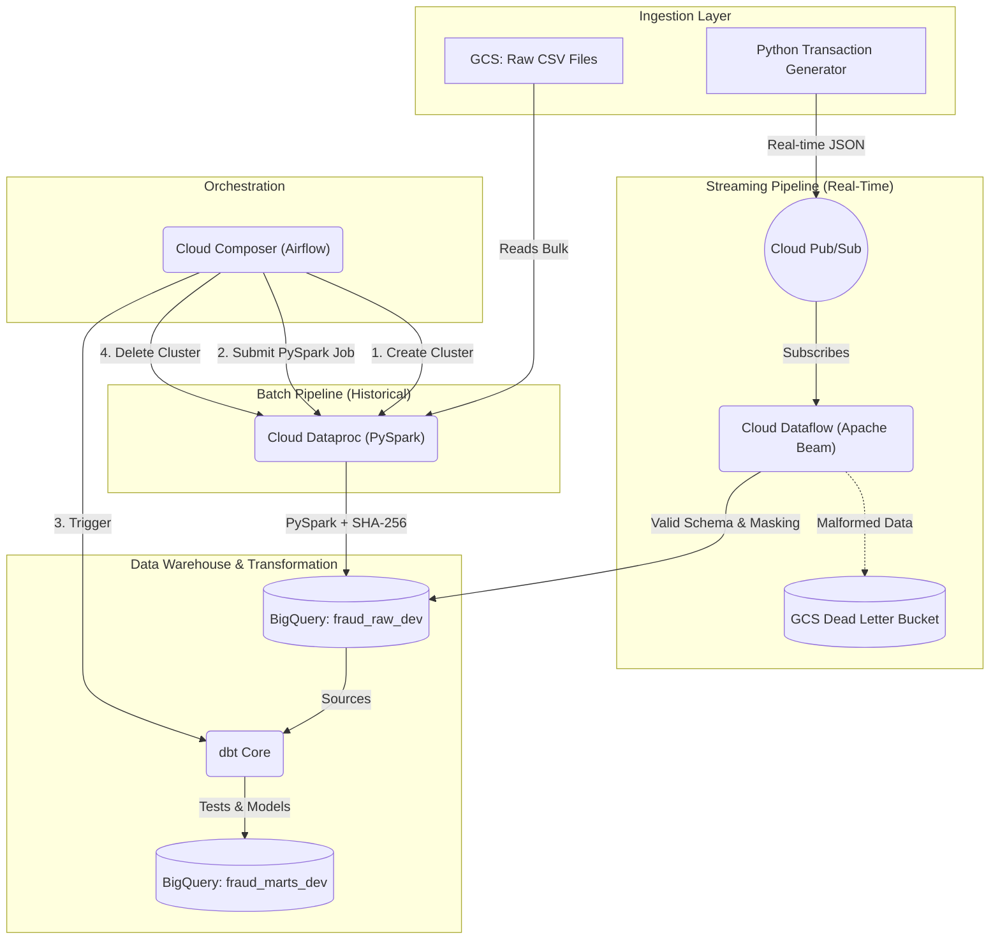

# Enterprise GCP Fraud Detection Platform

## 📌 Project Overview
A production-grade Lambda Architecture implementation processing millions of synthetic financial transactions. It features real-time streaming (Apache Beam/Dataflow) and bulk batch processing (PySpark/Dataproc), governed by Terraform (IaC), orchestrated by Cloud Composer (Airflow), and transformed using dbt.

## 🌐 End-to-End System Architecture

## 🏗️ Repository Structure
| Directory | Purpose |
|---|---|
| `/infrastructure` | Terraform declarative IaC for all GCP resources. |
| `/data_generator` | Python simulation engine generating 26-column synthetic transactions. |
| `/streaming_pipeline` | Apache Beam pipeline for real-time Pub/Sub ingestion and PII masking. |
| `/batch_pipeline` | PySpark jobs for massive historical CSV processing on Dataproc. |
| `/airflow_dags` | Cloud Composer DAG orchestrating the ephemeral Dataproc cluster pattern. |
| `/dbt_fraud` | SQL models for analytics engineering and data quality testing (`schema.yml`). |

## 🚀 Execution Flow
1. Provision infrastructure: `cd infrastructure && terraform apply`
2. Start streaming: `python data_generator/transaction_generator.py --mode stream`
3. Launch Dataflow: `python streaming_pipeline/fraud_streaming_pipeline.py --runner DataflowRunner`
4. Trigger Batch/dbt: via Airflow UI (`fraud_batch_dag.py`)

*See individual folder READMEs for deep technical details.*
