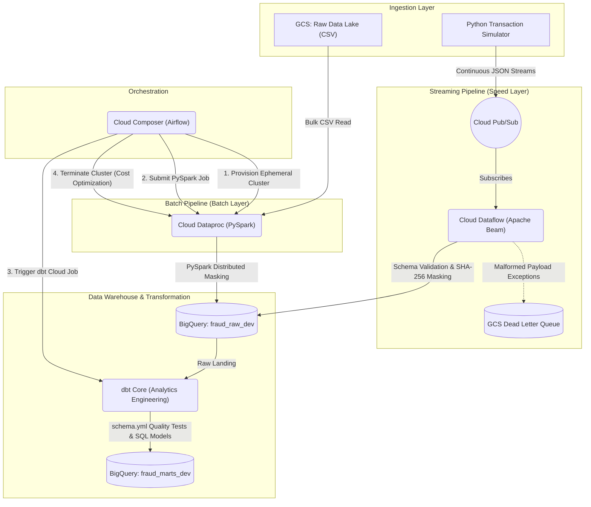

  <h1>🛡️ Enterprise GCP Fraud Detection Platform</h1>
  
<strong>A Production-Grade Lambda Architecture for Financial Transaction Security</strong>

---

## 📌 Executive Summary
This repository contains the complete infrastructure and codebase for a massively scalable **Fraud Detection Data Engine**. Designed on **Google Cloud Platform (GCP)**, it implements a **Lambda Architecture** capable of processing millions of synthetic credit card transactions. 

The system simultaneously handles **real-time streaming** (via Pub/Sub and Dataflow) for sub-second fraud detection, and **bulk historical batch processing** (via Dataproc PySpark) for deep analytics. The entire stack is orchestrated by **Apache Airflow** (Cloud Composer), governed by **Terraform** (Infrastructure as Code), and modeled using **dbt** (Data Build Tool).

## 🌐 End-to-End Enterprise Architecture

## 🏗️ Repository Blueprint & Tech Stack
This project follows strict software engineering practices, separating concerns into independent deployment modules:

| Module | Tech Stack | Enterprise Purpose |
|---|---|---|
| **[`/infrastructure`](./infrastructure)** | Terraform (HCL), GCP API | Declarative provisioning of Pub/Sub, BigQuery, GCS, and IAM roles to ensure identical dev/prod environments. |
| **[`/data_generator`](./data_generator)** | Python 3.9, Faker | Data simulation engine creating 50,000 unique behavioral profiles and enforcing a strict 26-column JSON schema. |
| **[`/streaming_pipeline`](./streaming_pipeline)** | Apache Beam, Dataflow | Serverless real-time pipeline enforcing schemas and applying SHA-256 PII hashing on-the-fly. |
| **[`/batch_pipeline`](./batch_pipeline)** | PySpark, Dataproc | Distributed big data processing applying equivalent PII masking over millions of historical CSV records. |
| **[`/airflow_dags`](./airflow_dags)** | Apache Airflow, Composer | Master orchestrator utilizing the Ephemeral Cluster Pattern to eliminate idle cloud compute costs. |
| **[`/dbt_fraud`](./dbt_fraud)** | dbt Core, SQL | Analytics engineering layer enforcing `not_null`/`unique` tests and materializing Star Schema data marts. |

## 🚀 Deployment Guide
Follow these steps to deploy the engine in a new GCP environment:
1. **Authenticate:** `gcloud auth application-default login`
2. **Provision Infrastructure:** `cd infrastructure && terraform init && terraform apply`
3. **Deploy DAGs:** Upload `fraud_batch_dag.py` to the Cloud Composer GCS bucket.
4. **Deploy Streaming:** `python streaming_pipeline/fraud_streaming_pipeline.py --runner DataflowRunner`
5. **Start Data Generator:** `python data_generator/transaction_generator.py --mode stream`

## 🛡️ Security & Compliance
- **PII Protection:** Native SHA-256 cryptographic hashing applied to `card_number` and `customer_id` before data lands in BigQuery.
- **Least Privilege:** Terraform provisions dedicated Service Accounts for Dataflow and Dataproc.
- **Data Quality:** dbt `schema.yml` halts transformations if data integrity constraints fail.
