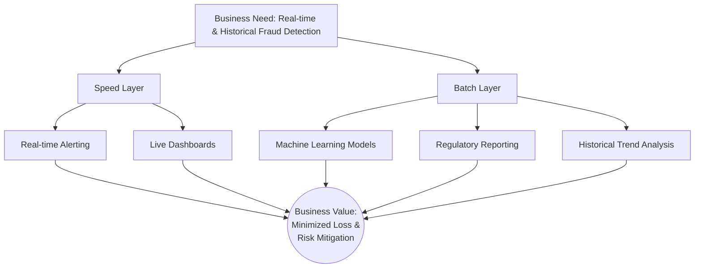
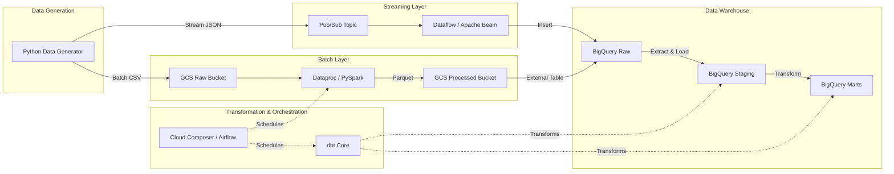
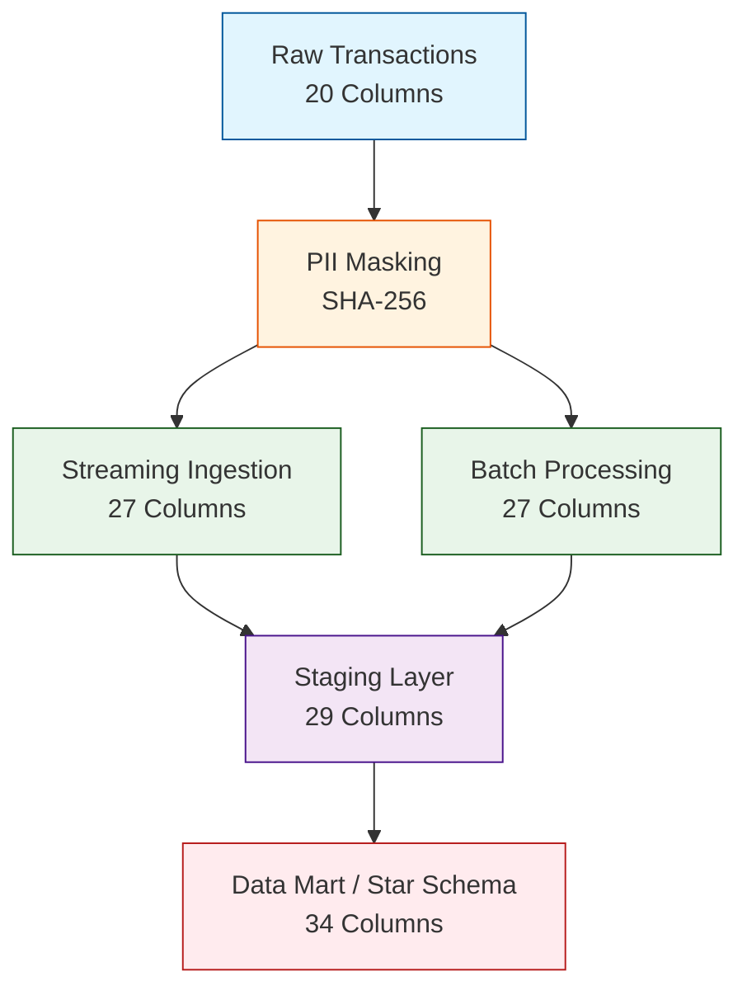
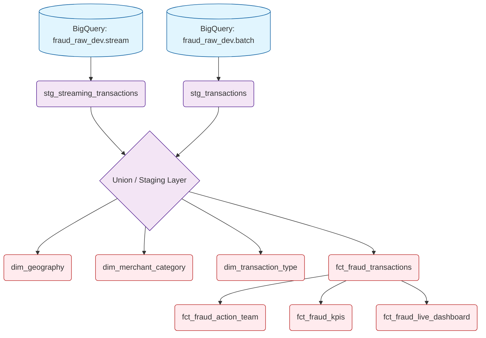

# 🛡️ Enterprise GCP Fraud Detection Platform


## 📋 Executive Summary

The Enterprise GCP Fraud Detection Platform is an end-to-end data engineering solution built on Google Cloud Platform, designed to detect and process fraudulent transactions using a Lambda Architecture. This architecture bridges the gap between low-latency streaming processing and high-throughput batch processing, providing the business with both real-time alerts and comprehensive historical analysis. By leveraging a synthetic data generator based on Python's Faker library, this platform simulates real-world transaction patterns, including PII details which are rigorously anonymized using SHA-256 hashing.

Our solution implements industry best practices including infrastructure as code (Terraform), distributed data processing (Dataflow & Dataproc), automated scheduling (Cloud Composer/Airflow), and modular SQL transformations (dbt). The data flows gracefully from raw inception (20 columns) to structured staging layers (29 columns), culminating in enriched, analytical marts (34-column Star Schema). This empowers downstream dashboards and machine learning models with clean, secure, and reliable data for making proactive risk mitigation decisions.

---

## 🏛️ Architecture

### 1. Business Architecture


```mermaid
graph TD
    A[Business Need: Real-time & Historical Fraud Detection] --> B[Speed Layer]
    A --> C[Batch Layer]
    
    B --> D[Real-time Alerting]
    B --> E[Live Dashboards]
    
    C --> F[Machine Learning Models]
    C --> G[Regulatory Reporting]
    C --> H[Historical Trend Analysis]
    
    D --> I((Business Value:<br/>Minimized Loss &<br/>Risk Mitigation))
    E --> I
    F --> I
    G --> I
    H --> I
```

### 2. System Architecture


```mermaid
graph LR
    subgraph Data Generation
        A[Python Data Generator]
    end

    subgraph Streaming Layer
        B[Pub/Sub Topic]
        C[Dataflow / Apache Beam]
    end

    subgraph Batch Layer
        D[GCS Raw Bucket]
        E[Dataproc / PySpark]
        F[GCS Processed Bucket]
    end

    subgraph Data Warehouse
        G[BigQuery Raw]
        H[BigQuery Staging]
        I[BigQuery Marts]
    end
    
    subgraph Transformation & Orchestration
        J[dbt Core]
        K[Cloud Composer / Airflow]
    end

    A -->|Stream JSON| B
    A -->|Batch CSV| D
    
    B --> C
    C -->|Insert| G
    
    D --> E
    E -->|Parquet| F
    F -->|External Table| G
    
    G -->|Extract & Load| H
    H -->|Transform| I
    
    J -.->|Transforms| H
    J -.->|Transforms| I
    K -.->|Schedules| E
    K -.->|Schedules| J
```

### 3. Data Flow Model


```mermaid
flowchart TD
    Raw[Raw Transactions<br/>20 Columns] --> Masking[PII Masking<br/>SHA-256]
    Masking --> Stream[Streaming Ingestion<br/>27 Columns]
    Masking --> Batch[Batch Processing<br/>27 Columns]
    Stream --> Stage[Staging Layer<br/>29 Columns]
    Batch --> Stage
    Stage --> Mart[Data Mart / Star Schema<br/>34 Columns]
    
    style Raw fill:#e1f5fe,stroke:#01579b
    style Masking fill:#fff3e0,stroke:#e65100
    style Stream fill:#e8f5e9,stroke:#1b5e20
    style Batch fill:#e8f5e9,stroke:#1b5e20
    style Stage fill:#f3e5f5,stroke:#4a148c
    style Mart fill:#ffebee,stroke:#b71c1c
```

---

## 🛠️ Technology Stack

| Component | GCP Product / Service | Purpose |
|-----------|-----------------------|---------|
| **Infrastructure** | Terraform | Infrastructure as Code provisioning. |
| **Data Generation** | Python (Faker) | Synthetic transaction creation. |
| **Message Queue** | Cloud Pub/Sub | Real-time event ingestion. |
| **Stream Processing** | Cloud Dataflow (Apache Beam) | Real-time PII masking & BQ streaming. |
| **Object Storage** | Cloud Storage (GCS) | Data lake for raw/processed batch data. |
| **Batch Processing** | Cloud Dataproc (PySpark) | Ephemeral cluster processing of large files. |
| **Data Warehouse** | BigQuery | Scalable, columnar SQL data warehouse. |
| **Transformation** | dbt (Data Build Tool) | Data modeling and testing (9 models, 50 tests). |
| **Orchestration** | Cloud Composer (Apache Airflow) | DAG scheduling for batch and dbt jobs. |

---

## 📂 Project Structure

```text
.
├── .github/
│   └── workflows/          # CI/CD Pipelines
├── airflow_dags/
│   └── fraud_batch_dag.py  # 6-task incremental daily DAG
├── batch_pipeline/
│   └── pyspark_jobs/
│       ├── batch_fraud_pipeline.py # Spark batch job
│       └── update_partition.py
├── dashboards/             # BI Tool Configurations
├── data_generator/
│   ├── config.py
│   ├── generate_sample_data.py # Faker script
│   ├── upload_to_gcs.sh
│   └── transaction_generator.py
├── dbt_fraud/
│   ├── dbt_project.yml
│   └── models/
│       ├── marts/          # 34-column fact & dimension tables
│       └── staging/        # Staging views
├── docs/                   # Additional documentation
├── infrastructure/
│   ├── main.tf             # Core terraform configuration
│   └── variables.tf
├── streaming_pipeline/
│   └── fraud_streaming_pipeline.py # Beam pipeline
└── tests/                  # Unit and integration tests
```

---

## 🏗️ Infrastructure Components

- **GCS Buckets**:
  - `fraud-dev-raw-data-2026`: Landing zone for raw batch files.
  - `fraud-dev-processed-data-2026`: Parquet storage for Dataproc outputs.
  - `fraud-dev-dataflow-temp-2026`: Staging and temp files for Dataflow jobs.
- **Pub/Sub**:
  - Topic: `fraud-transactions-dev`
  - Subscription: `fraud-transactions-sub-dev`
- **BigQuery Datasets**:
  - `fraud_raw_dev`: Raw landing data from streaming and batch.
  - `fraud_staging_dev`: Cleansed, uniform views.
  - `fraud_marts_dev`: Star schema for BI and ML consumption.

---

## 🚀 Quick Start Guide

1. **Infrastructure Provisioning**:
   ```bash
   cd infrastructure
   terraform init
   terraform apply -auto-approve
   ```

2. **Generate Synthetic Data**:
   ```bash
   cd data_generator
   python generate_sample_data.py --mode stream # For Pub/Sub
   python generate_sample_data.py --mode batch  # For GCS
   ```

3. **Start Streaming Pipeline**:
   ```bash
   cd streaming_pipeline
   python fraud_streaming_pipeline.py \
     --project=YOUR_PROJECT_ID \
     --region=us-central1 \
     --runner=DataflowRunner
   ```

4. **Run Data Transformations**:
   ```bash
   cd dbt_fraud
   dbt deps
   dbt run
   dbt test
   ```

5. **Deploy Airflow DAG**:
   Copy the `airflow_dags/fraud_batch_dag.py` to your Cloud Composer dags bucket to orchestrate the daily batch jobs.

---

## 🌟 Key Features

- **Lambda Architecture**: Seamless unification of streaming and batch data processing paradigms.
- **Robust Security**: SHA-256 PII Masking applied in-flight for `customer_id`, `receiver_id`, `card_number`, `device_id`, and `ip_address`.
- **Incremental Processing**: Airflow and dbt models are designed for efficient, daily incremental loads.
- **Ephemeral Clusters**: Dataproc clusters are created on-the-fly and destroyed post-job to minimize costs.
- **Dimensional Modeling**: 34-column Star Schema optimized for analytics and dashboarding.

---

## 🔗 dbt Model Lineage


```mermaid
graph TD
    A1[(BigQuery: fraud_raw_dev.stream)] --> B1(stg_streaming_transactions)
    A2[(BigQuery: fraud_raw_dev.batch)] --> B2(stg_transactions)
    
    B1 --> C{Union / Staging Layer}
    B2 --> C
    
    C --> D(dim_geography)
    C --> E(dim_merchant_category)
    C --> F(dim_transaction_type)
    C --> G(fct_fraud_transactions)
    
    G --> H(fct_fraud_action_team)
    G --> I(fct_fraud_kpis)
    G --> J(fct_fraud_live_dashboard)
    
    classDef source fill:#e1f5fe,stroke:#01579b;
    classDef stage fill:#f3e5f5,stroke:#4a148c;
    classDef mart fill:#ffebee,stroke:#b71c1c;
    
    class A1,A2 source;
    class B1,B2,C stage;
    class D,E,F,G,H,I,J mart;
```

---

## 💰 Cost Optimization Strategies

1. **Ephemeral Processing**: Dataproc clusters run only during the Airflow DAG execution.
2. **Data Partitioning**: BigQuery tables are partitioned by `transaction_date` to limit scan costs during queries.
3. **Storage Classes**: GCS lifecycle rules transition old raw data to Coldline/Archive storage.
4. **Dataflow Autoscaling**: The streaming job scales worker nodes based on Pub/Sub backlog.

---

## 🧪 Testing & Data Quality

Data quality is treated as a first-class citizen using dbt.
- **50+ dbt Tests**: Ensures referential integrity, uniqueness, and nullity constraints.
- **Schema Validation**: Staging views enforce strict data type casting and formatting.
- **PySpark Asserts**: Batch jobs enforce schema validation before writing out Parquet files.

---

## 🤝 Contributing

Contributions are welcome! Please follow these steps:
1. Fork the repository.
2. Create a feature branch (`git checkout -b feature/AmazingFeature`).
3. Commit your changes (`git commit -m 'Add some AmazingFeature'`).
4. Push to the branch (`git push origin feature/AmazingFeature`).
5. Open a Pull Request.

---

## 📄 License

This project is licensed under the MIT License. See the `LICENSE` file for more details.
