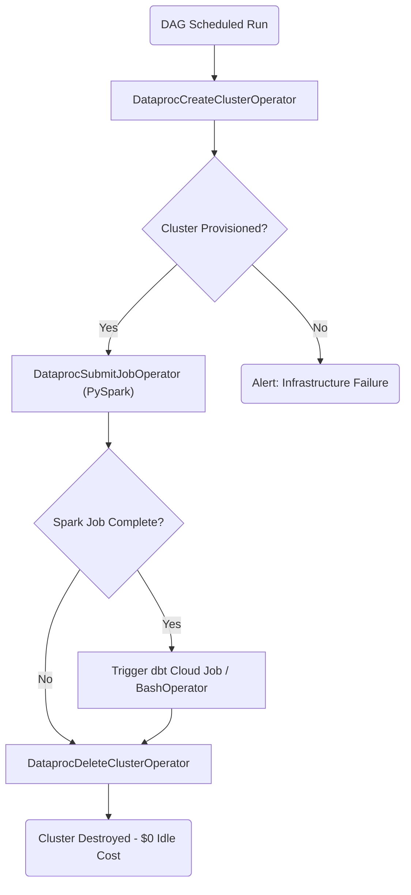

# Pipeline Orchestration (Airflow)

## 📌 Enterprise Purpose
This module is the brain of the automated batch data lifecycle. It uses **Apache Airflow** (running on Cloud Composer) to orchestrate dependencies. Most importantly, it implements the **Ephemeral Cluster Pattern**—spinning up a Dataproc cluster just-in-time, running the Spark job, triggering dbt, and immediately tearing the cluster down. This practice saves thousands of dollars in idle cloud compute costs.

## 🔄 DAG Execution Graph (Dependencies)


## 📦 Required Software & Dependencies
- `pip install apache-airflow` (For local syntax validation).
- `pip install apache-airflow-providers-google` (Required to use GCP-specific operators like Dataproc).

## 📄 DAG Breakdown (File: `fraud_batch_dag.py`)
- Defines the DAG with `schedule_interval='@daily'`.
- **Task 1:** Defines the Dataproc cluster hardware configuration (Master/Worker machine types).
- **Task 2:** Submits the PySpark file stored in GCS.
- **Task 3:** Triggers the downstream analytics transformation.
- **Task 4 (Critical):** Uses `trigger_rule='all_done'`. This ensures that even if Task 2 (Spark) throws a fatal exception, Airflow will still execute Task 4 to delete the cluster, preventing massive cloud billing leaks.

## 🚀 Deployment Instructions
Simply copy the python file into the GCS bucket monitored by Cloud Composer:
```bash
gsutil cp fraud_batch_dag.py gs://<COMPOSER_BUCKET>/dags/
```
