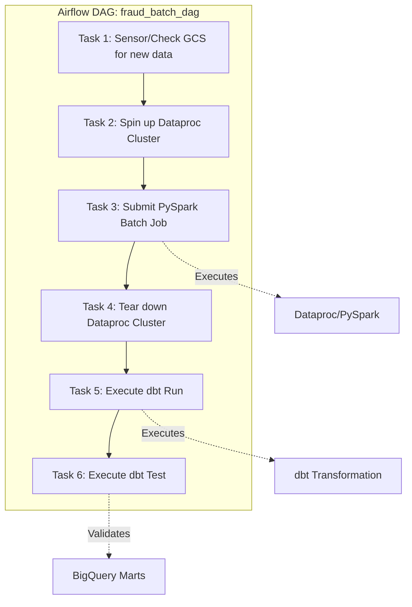

# Pipeline Orchestration (Cloud Composer / Airflow)

## Purpose

The `airflow_dags` directory contains the orchestration logic for the Enterprise GCP Fraud Detection Platform. Utilizing Apache Airflow hosted on Google Cloud Composer, these Directed Acyclic Graphs (DAGs) schedule, coordinate, and monitor the daily incremental execution of our batch processing and transformation workloads.

The primary DAG manages a robust 6-task workflow that transitions data from raw GCS storage through Dataproc processing and dbt BigQuery transformations, ensuring dependencies are respected and failures are handled gracefully.

## Architecture


```mermaid
graph TD
    subgraph Airflow DAG: fraud_batch_dag
        T1[Task 1: Sensor/Check GCS for new data]
        T2[Task 2: Spin up Dataproc Cluster]
        T3[Task 3: Submit PySpark Batch Job]
        T4[Task 4: Tear down Dataproc Cluster]
        T5[Task 5: Execute dbt Run]
        T6[Task 6: Execute dbt Test]
        
        T1 --> T2
        T2 --> T3
        T3 --> T4
        T4 --> T5
        T5 --> T6
    end
    
    T3 -.->|Executes| DP[Dataproc/PySpark]
    T5 -.->|Executes| DBT[dbt Transformation]
    T6 -.->|Validates| BQ[BigQuery Marts]
```

## Files

- `fraud_batch_dag.py`: The main Airflow Python script defining the DAG, tasks, operators, and execution dependencies.
- `requirements.txt`: Python dependencies required by the Cloud Composer environment (e.g., dbt-bigquery operator, Dataproc providers).

## Configuration

DAG parameters are defined within the Python script:
- `schedule_interval`: Typically set to `@daily` or a specific cron expression.
- `catchup`: Configured (usually `False`) to prevent backfilling massive historical loads unless explicitly requested.
- **Airflow Variables/Connections**: Uses standard GCP connections managed in the Airflow UI to authenticate with Dataproc, GCS, and BigQuery.

## How It Works

1. **Trigger**: The DAG is triggered on its scheduled interval (daily).
2. **Sensing (Task 1)**: An operator checks the `fraud-dev-raw-data-2026` bucket to ensure new batch files are present for the given execution date.
3. **Provisioning (Task 2)**: Uses the `DataprocCreateClusterOperator` to spin up a temporary compute cluster tailored for the job size.
4. **Processing (Task 3)**: Uses the `DataprocSubmitJobOperator` to execute the PySpark application, processing raw data into Parquet in `fraud-dev-processed-data-2026`.
5. **Teardown (Task 4)**: Uses the `DataprocDeleteClusterOperator` to delete the cluster, optimizing cloud costs.
6. **Transformation (Task 5 & 6)**: Executes `BashOperator` or native dbt operators to run `dbt run` and `dbt test`, finalizing the data in BigQuery `fraud_marts_dev`.

## Dependencies

- **Google Cloud Composer**: Version 2.x (Airflow 2.4+).
- **apache-airflow-providers-google**: For Dataproc, GCS, and BigQuery operators.

## Commands

While typically executed automatically on schedule in Composer, you can test DAGs locally:

```bash
# Test a specific task locally (requires local Airflow setup)
airflow tasks test fraud_daily_batch_pipeline create_dataproc_cluster 2026-01-01

# Trigger a manual DAG run via CLI
gcloud composer environments run [ENV_NAME]     --location us-central1 dags trigger -- fraud_daily_batch_pipeline
```

## Integration Points

- **Batch Pipeline**: Orchestrates the Dataproc PySpark job.
- **dbt Transformations**: Orchestrates the BigQuery SQL models.
- **Infrastructure**: Assumes all necessary service accounts and permissions are provisioned by Terraform.
