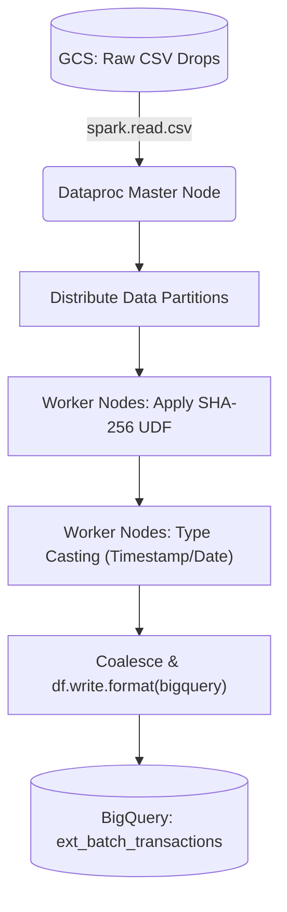

# Batch Processing Pipeline (Batch Layer)

## 📌 Enterprise Purpose
This module handles massive, bulk historical data processing using **Apache Spark**. When processing 10+ million CSV records, Python scripts run out of memory. This PySpark job is designed to be executed on a distributed **Cloud Dataproc** cluster, applying the exact same PII masking logic as the streaming layer, ensuring data consistency across the Lambda Architecture.

## 🔄 Distributed Execution Flow


## 📦 Required Software & Dependencies
- **Local Testing:** `pip install pyspark` and `Java 11`.
- **Production:** Cloud Dataproc pre-installs Apache Spark and the Spark-BigQuery connector. No manual dependency management is required.

## 📄 Pipeline Stages (File: `batch_fraud_pipeline.py`)
1. **Session Init:** Creates a `SparkSession` configured for the BigQuery connector.
2. **UDF Registration:** Registers a Python User Defined Function to execute the SHA-256 masking in a distributed manner across Spark workers.
3. **Transformation:** Converts string dates from the CSV into native SQL `TIMESTAMP` and `DATE` types.
4. **Sinking:** Utilizes the highly optimized `spark-bigquery-connector` to stream chunks directly into the data warehouse.

## 🚀 Execution Instructions
*(Note: In production, this job is submitted automatically by Airflow. To run manually for debugging:)*
```bash
gcloud dataproc jobs submit pyspark batch_fraud_pipeline.py \
  --cluster=fraud-dev-ephemeral-cluster \
  --region=asia-south1
```
