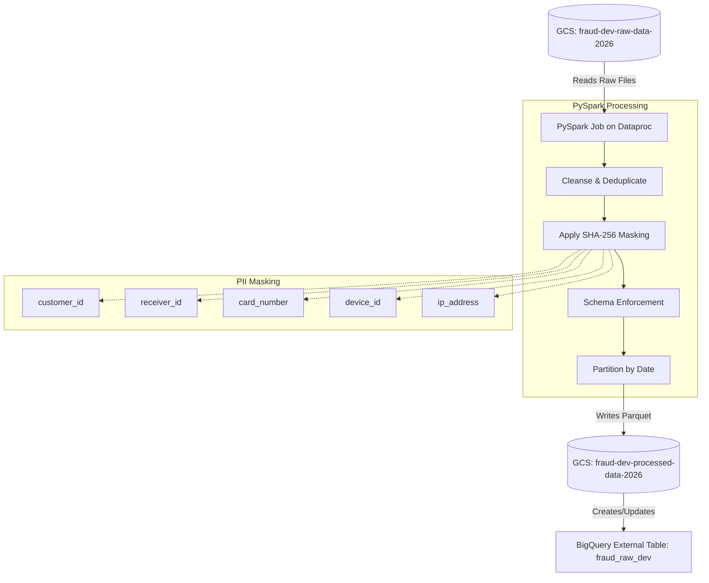

# Batch Processing Pipeline (Dataproc / PySpark)

## Purpose

The `batch_pipeline` module constitutes the historical and bulk-processing component of the Lambda Architecture. Using Apache Spark (PySpark) executed on Google Cloud Dataproc, this pipeline is designed to efficiently process massive volumes of historical transaction data stored in Google Cloud Storage (GCS).

It reads raw batch files (JSON/CSV), applies robust data cleansing and PII masking, converts the data into highly optimized Parquet format, and stages it for BigQuery via External Tables. This ensures cost-effective storage and high-performance querying for historical analysis.

## Architecture


```mermaid
graph TD
    GCS_RAW[(GCS: fraud-dev-raw-data-2026)] -->|Reads Raw Files| SPARK[PySpark Job on Dataproc]
    
    subgraph PySpark Processing
        SPARK --> CLEANSE[Cleanse & Deduplicate]
        CLEANSE --> MASK[Apply SHA-256 Masking]
        MASK --> TRANSFORM[Schema Enforcement]
        TRANSFORM --> PARTITION[Partition by Date]
    end
    
    PARTITION -->|Writes Parquet| GCS_PROC[(GCS: fraud-dev-processed-data-2026)]
    GCS_PROC -->|Creates/Updates| BQ[BigQuery External Table: fraud_raw_dev]
    
    subgraph PII Masking
        MASK -.-> customer_id
        MASK -.-> receiver_id
        MASK -.-> card_number
        MASK -.-> device_id
        MASK -.-> ip_address
    end
```

## Files

- `pyspark_jobs/batch_fraud_pipeline.py`: The core PySpark application containing the DataFrame operations for cleansing, hashing, and writing data.
- `cluster_config.sh`: Shell script containing Google Cloud CLI commands to provision an ephemeral Dataproc cluster optimized for this workload.
- `submit_job.sh`: Convenience script to submit the PySpark job to the active Dataproc cluster.

## Configuration

The PySpark job requires several arguments:
- `--input_path`: GCS path to the raw data (e.g., `gs://fraud-dev-raw-data-2026/incoming/`).
- `--output_path`: GCS path for the processed Parquet data (e.g., `gs://fraud-dev-processed-data-2026/parquet/`).
- `--bq_dataset`: The BigQuery dataset to link the external table.

## How It Works

1. **Extraction**: The Spark job initiates a read operation spanning the specified prefix in the raw GCS bucket, distributed across the cluster worker nodes.
2. **Cleansing & Masking**: Invalid records are filtered. Spark SQL functions (`sha2`) are applied to mask the five critical PII columns (`customer_id`, `receiver_id`, `card_number`, `device_id`, `ip_address`), identical to the streaming pipeline logic to ensure data consistency.
3. **Transformation**: Data types are cast to enforce schema compliance.
4. **Load (GCS)**: The DataFrame is written back to the processed GCS bucket in columnar Parquet format, partitioned by transaction date (`year/month/day`) for query optimization.
5. **Load (BigQuery)**: A BigQuery External Table definition is updated to point to the newly written Parquet files, making the historical data immediately queryable without duplicating storage in BQ.

## Dependencies

- **Apache Spark 3.x**: Runtime framework.
- **Google Cloud Dataproc**: Managed cluster environment.
- **Cloud Storage Connector for Spark**: Included by default in Dataproc.

## Commands

```bash
# Provision the Dataproc cluster
./cluster_config.sh create

# Submit the PySpark batch job
gcloud dataproc jobs submit pyspark pyspark_jobs/batch_fraud_pipeline.py     --cluster fraud-batch-cluster     --region us-central1     -- --input_path gs://fraud-dev-raw-data-2026/        --output_path gs://fraud-dev-processed-data-2026/

# Tear down the ephemeral cluster
./cluster_config.sh delete
```

## Integration Points

- **Data Generator**: Processes large batch files generated and uploaded to the raw GCS bucket.
- **Airflow DAGs**: This job is primarily triggered and orchestrated by Cloud Composer on a scheduled basis (incremental daily load).
- **dbt Transformations**: The resulting BigQuery External Table serves as the historical source for dbt models.
