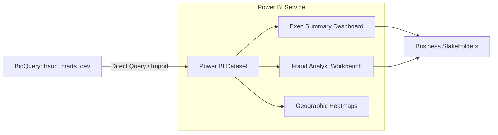

# BI & Analytics (Power BI Dashboards)

## Purpose

The `dashboards` directory houses the visual analytics layer of the platform. Using Microsoft Power BI, these reporting assets connect directly to our highly optimized BigQuery mart tables to provide stakeholders, fraud analysts, and data scientists with actionable insights into transaction trends, fraud rates, and anomaly detection.

These dashboards represent the final consumption point of the Lambda Architecture, presenting both near real-time metrics (from streaming) and deep historical trends (from batch).

## Architecture

## Files

- `fraud_platform_main.pbix`: The primary Power BI desktop file containing the data model, DAX measures, and visual reports.
- `theme.json`: Custom Power BI theme file ensuring corporate branding and consistent visual styling.
- `README.md`: This documentation.

## Configuration

- **Data Source**: Connects to Google BigQuery using the native Power BI connector.
- **Authentication**: Uses Organizational Account (OAuth2) passing through GCP IAM to ensure the user viewing the report has permissions to access the underlying BigQuery dataset.
- **Storage Mode**: Employs a hybrid model. Aggregated summary tables may use *Import* mode for lightning-fast filtering, while detailed drill-downs use *DirectQuery* to fetch the latest data directly from the 34-column `fct_transactions` table.

## How It Works

1. **Connection**: The `.pbix` file establishes a connection to the `fraud_marts_dev` BigQuery dataset.
2. **Modeling**: Relationships are established between the central fact table (`fct_transactions`) and supporting dimensions (e.g., date, merchant category).
3. **DAX Measures**: Complex aggregations (e.g., Year-over-Year fraud rate change, rolling 7-day average transaction amount) are calculated dynamically using DAX.
4. **Visualization**: Data is rendered into interactive elements like time-series line charts, geographic scatter plots (using masked IPs/locations), and tabular drill-downs for specific flagged transactions.

## Dependencies

- **Power BI Desktop**: For local development and modification.
- **Power BI Service**: For publishing and sharing within the organization.
- **BigQuery Access**: Viewers must have BigQuery Data Viewer roles in GCP.

## Commands

*No CLI commands. Open `fraud_platform_main.pbix` in Power BI Desktop to interact.*

## Integration Points

- **dbt Transformations**: The dashboard entirely depends on the schema and data quality of the models materialized by dbt in the `fraud_marts_dev` dataset.
