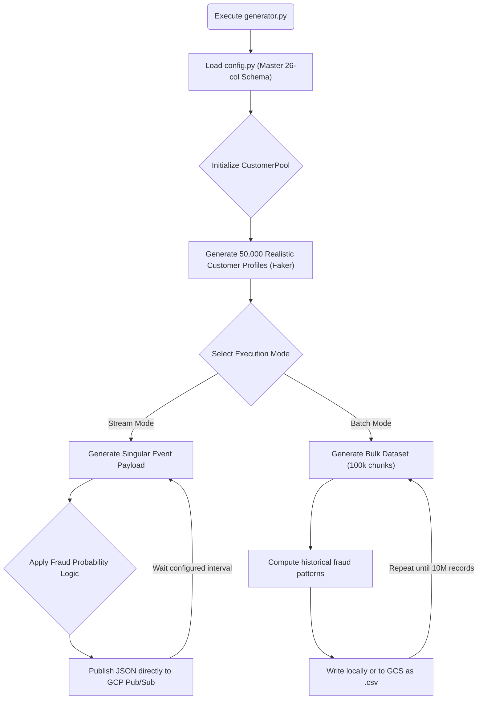

# Data Simulation Engine

## 📌 Enterprise Purpose
In the absence of real PII financial data, this module serves as a highly sophisticated **Synthetic Data Generator**. It does not output random noise; it utilizes the to generate 50,000 distinct customer profiles and explicitly simulates real-world fraudulent behaviors (e.g., rapid consecutive transactions, location spoofing) based on a strict 26-column Master Schema.

## 🔄 Simulation Logic Flow


## 📦 Required Software & Dependencies
- **Python 3.9+**

- `pip install google-cloud-pubsub` (Required to push payloads to GCP).

## 📄 File Breakdown
| File | Functionality |
|---|---|
| `config.py` | The **Master Schema Contract**. Defines the exact 26 columns, data types, and the 12 specific fraud scenarios. No pipeline will function if this schema is violated. |
| `transaction_generator.py` | The execution engine. Loops infinitely in streaming mode, or runs a fixed `for` loop in batch mode to output millions of records. |

## 🚀 Execution Instructions
**To simulate live production traffic (Streaming):**
```bash
python transaction_generator.py --mode stream --rate 100 --total 50000
```
**To generate a historical dataset (Batch):**
```bash
python transaction_generator.py --mode batch --records 10000000
```
