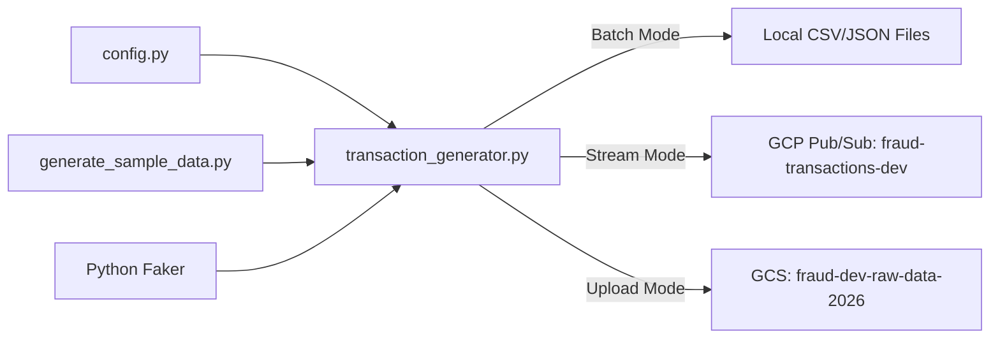

# Synthetic Fraud Data Generator

## Purpose

The `data_generator` module is a Python-based utility designed to simulate realistic financial transaction data for the Enterprise GCP Fraud Detection Platform. Utilizing the Python Faker library, this tool generates synthetic records mimicking both normal customer behavior and various fraudulent patterns.

It is crucial for end-to-end testing, validating pipeline transformations, and training/evaluating downstream machine learning models without exposing real Personally Identifiable Information (PII) or financial records.

## Architecture


```mermaid
graph LR
    CFG[config.py] --> GEN[transaction_generator.py]
    MAIN[generate_sample_data.py] --> GEN
    FAKER[Python Faker] --> GEN
    GEN --> |Batch Mode| CSV[Local CSV/JSON Files]
    GEN --> |Stream Mode| PS[GCP Pub/Sub: fraud-transactions-dev]
    GEN --> |Upload Mode| GCS[GCS: fraud-dev-raw-data-2026]
```

## Files

- `config.py`: Configuration parameters controlling generation volume, fraud ratios, data schema, and output targets (GCS bucket names, Pub/Sub topic names).
- `transaction_generator.py`: Core logic utilizing the Faker library to create individual transaction profiles, applying domain-specific rules (e.g., velocity rules, impossible travel simulations) to embed synthetic fraud.
- `generate_sample_data.py`: CLI entrypoint to start the generation process, accepting arguments for batch size, output format, and destination.

## Configuration

Key settings managed in `config.py`:
- `FRAUD_RATE`: Probability of a transaction being marked as fraudulent (e.g., 0.05 for 5%).
- `GCP_PROJECT`: Target project for Pub/Sub publishing.
- `PUBSUB_TOPIC`: `fraud-transactions-dev`.
- `GCS_RAW_BUCKET`: `fraud-dev-raw-data-2026`.
- `BATCH_SIZE`: Number of records to generate per file in batch mode.

## How It Works

1. **Initialization**: The script reads configuration and initializes Faker providers, including custom ones for financial entities.
2. **Profile Generation**: It first creates a static pool of synthetic users (customers and merchants) with consistent IDs.
3. **Transaction Simulation**: For each event, it pairs a customer and merchant, generating realistic values for amount, timestamp, location, device ID, and IP address.
4. **Fraud Injection**: Based on the `FRAUD_RATE`, specific transaction parameters are skewed to mimic known fraud vectors (e.g., sudden massive spikes in transaction amount, mismatched billing/shipping zip codes).
5. **Output Routing**: The generated payload (JSON or CSV) is either written to a local file, uploaded directly to GCS for batch processing, or pushed to the Pub/Sub topic for streaming ingestion.

## Dependencies

- **Python 3.9+**
- **Faker**: For synthetic data generation.
- **google-cloud-storage**: For direct GCS uploads.
- **google-cloud-pubsub**: For streaming to the Pub/Sub topic.

## Commands

```bash
# Install dependencies
pip install -r requirements.txt

# Generate 10,000 records to local JSON
python generate_sample_data.py --format json --count 10000 --output local

# Stream data continuously to Pub/Sub
python generate_sample_data.py --mode stream --topic fraud-transactions-dev

# Generate a batch and upload to GCS
python generate_sample_data.py --mode batch --count 50000 --upload-gcs fraud-dev-raw-data-2026
```

## Integration Points

- **Streaming Pipeline**: Feeds live messages directly into `fraud-transactions-dev` Pub/Sub topic.
- **Batch Pipeline**: Drops static files into `fraud-dev-raw-data-2026` for Dataproc ingestion.
