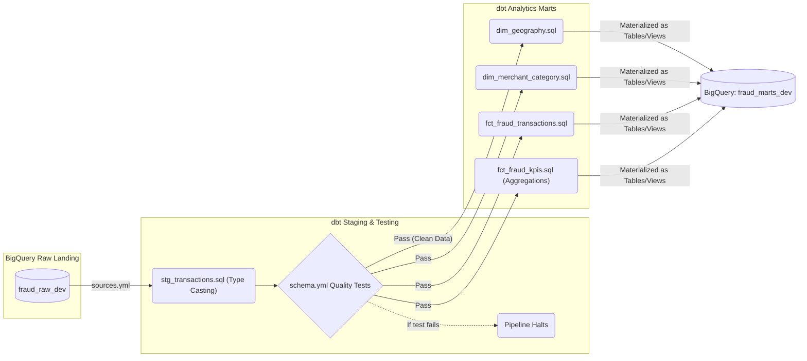

# Analytics Engineering (dbt Core)

## 📌 Enterprise Purpose
Once raw data lands in BigQuery via Streaming or Batch, it is untrustworthy and unoptimized. This module uses **dbt (Data Build Tool)** to implement Analytics Engineering best practices. It rigorously tests the data for quality (nulls, duplicates) and transforms it into a highly performant **Dimensional Star Schema** (Facts and Dimensions) ready for Power BI or Tableau consumption.

## 🔄 Data Build & Quality Assurance Flow


## 📦 Required Software & Dependencies
- `pip install dbt-core` (The framework execution engine).
- `pip install dbt-bigquery` (The adapter allowing dbt to push down SQL execution to BigQuery).

## 📄 File Breakdown
| File | Enterprise Functionality |
|---|---|
| `dbt_project.yml` | The heart of the dbt project. Configures materialization strategies (e.g., staging = views, marts = tables). |
| `sources.yml` | Declares the external BigQuery raw tables, allowing dbt to reference them using `{{ source() }}` syntax, creating a lineage graph. |
| `schema.yml` | **Data Quality Contract.** Contains declarative tests like `not_null`, `unique`, and `accepted_values` for crucial columns. |
| `stg_*.sql` | Staging layer: Purely handles renaming, casting, and standardizing raw columns. |
| `fct_*.sql` / `dim_*.sql` | Marts layer: The final business logic, aggregations, and Star Schema joins. |

## 🚀 Execution Instructions
```bash
# 1. Verify credentials and connection to BigQuery
dbt debug

# 2. Compile Jinja/SQL and materialize tables in BigQuery
dbt run

# 3. Execute the data quality assertions defined in schema.yml
dbt test
```
