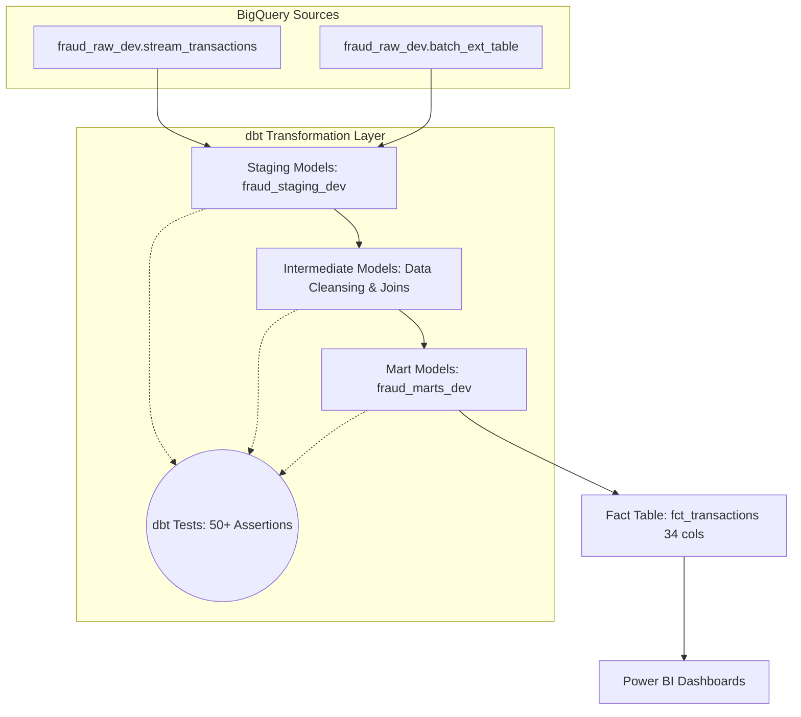

# Data Transformations (dbt)

## Purpose

The `dbt_fraud` module handles the transformation and modeling layer within BigQuery. Utilizing **dbt (data build tool)**, this directory contains the SQL-based logic required to clean, conform, and aggregate raw transaction data (from both streaming and batch sources) into a dimensional data warehouse structure.

It is responsible for executing 9 distinct models and enforcing data quality through 50 integrated tests. The final output is a highly optimized, 34-column fact table and associated dimension tables situated in the `fraud_marts_dev` dataset, ready for consumption by BI dashboards and machine learning applications.

## Architecture


```mermaid
graph TD
    subgraph BigQuery Sources
        RAW_STREAM[fraud_raw_dev.stream_transactions]
        RAW_BATCH[fraud_raw_dev.batch_ext_table]
    end
    
    subgraph dbt Transformation Layer
        STG[Staging Models: fraud_staging_dev]
        INT[Intermediate Models: Data Cleansing & Joins]
        MART[Mart Models: fraud_marts_dev]
        TESTS((dbt Tests: 50+ Assertions))
        
        STG --> INT
        INT --> MART
        STG -.-> TESTS
        INT -.-> TESTS
        MART -.-> TESTS
    end
    
    RAW_STREAM --> STG
    RAW_BATCH --> STG
    MART --> FINAL[Fact Table: fct_transactions 34 cols]
    FINAL --> BI[Power BI Dashboards]
```

## Files

- `dbt_project.yml`: The core configuration file for the dbt project, defining model materialization strategies (view, table, incremental) and variable bindings.
- `models/staging/`: Initial SQL models that unify and standardize data from the raw streaming and batch sources.
- `models/marts/`: Final business-level models, notably the 34-column fact table calculating fraud indicators, rolling averages, and velocity metrics.
- `models/schema.yml`: Defines table schemas, column descriptions, and data quality tests (not null, unique, accepted values).
- `macros/`: Reusable SQL snippets, such as standardized timestamp conversions or complex logic blocks.

## Configuration

Connections to BigQuery are managed via `profiles.yml` (typically located in `~/.dbt/`). The project requires:
- `type: bigquery`
- `method: oauth` or `service-account`
- `project: [GCP_PROJECT_ID]`
- `dataset: fraud_staging_dev`
- `threads: 4`

## How It Works

1. **Source Unification**: Staging models read from both the streaming insert tables and the batch external tables, performing a UNION to create a single, continuous stream of transaction history.
2. **Transformation**: Intermediate models apply business logic, such as deriving time-of-day features, flagging impossible travel scenarios, and calculating transaction velocity per masked `customer_id`.
3. **Materialization**: Mart models build the final fact and dimension tables. The primary `fct_transactions` table is materialized incrementally to optimize cost and performance on massive datasets.
4. **Testing**: Upon completion of runs, dbt executes 50 predefined tests (e.g., verifying `transaction_id` uniqueness, ensuring `amount` > 0) to guarantee data integrity before dashboard consumption.

## Dependencies

- **dbt-core & dbt-bigquery**: Version 1.5+.
- **BigQuery Datasets**: Target datasets (`fraud_staging_dev`, `fraud_marts_dev`) must be pre-provisioned by Terraform.

## Commands

```bash
# Verify connection to BigQuery
dbt debug

# Install any required dbt packages (if defined in packages.yml)
dbt deps

# Compile and run the 9 models
dbt run

# Execute the 50 data quality tests
dbt test

# Generate and serve documentation locally
dbt docs generate
dbt docs serve
```

## Integration Points

- **BigQuery**: Reads from raw datasets populated by Dataflow/Dataproc and writes to staging/mart datasets.
- **Airflow DAGs**: Triggered automatically as a downstream task in the Composer pipeline following the batch processing.
- **Dashboards**: The tables generated here are the direct source for Power BI analytics.
