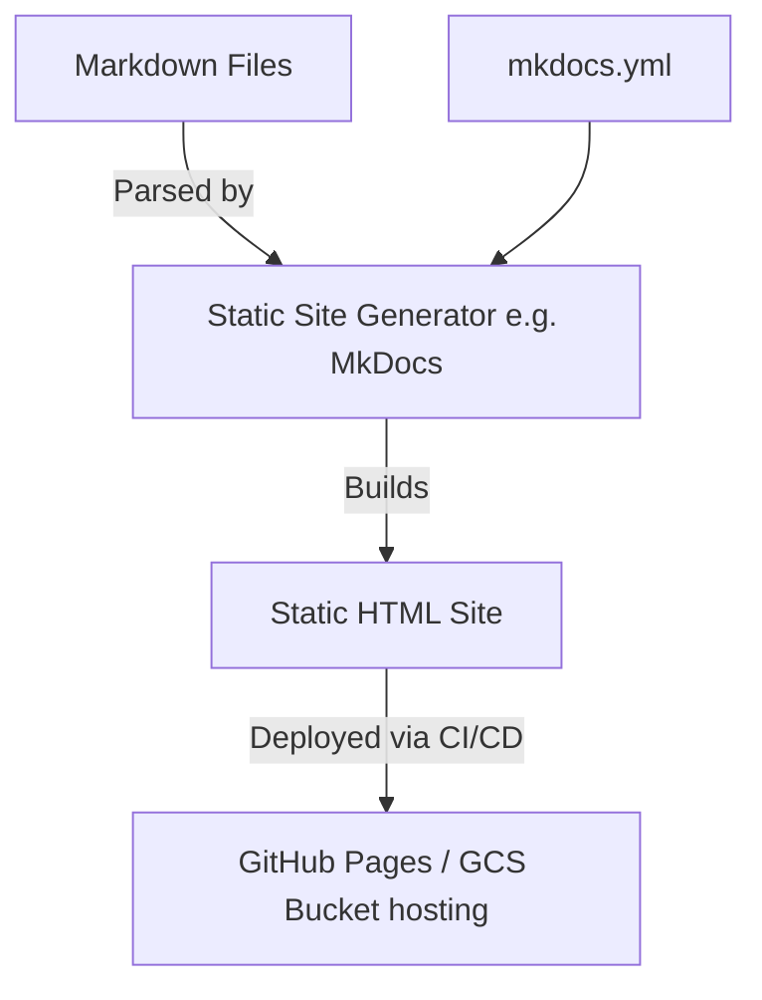

# Platform Documentation Portal

## Purpose

The `docs` directory contains the comprehensive, centralized documentation for the Enterprise GCP Fraud Detection Platform. It is designed to be rendered into a static site (e.g., using MkDocs or Docusaurus) providing developers, data engineers, and analysts with a single source of truth for architectural decisions, data dictionaries, runbooks, and API specs.

## Architecture



## Files

- `index.md`: The landing page and platform overview.
- `architecture.md`: Detailed system architecture designs and decisions.
- `data_dictionary.md`: Comprehensive mapping of schemas, specifically detailing the 27-column raw format and 34-column fact format.
- `runbooks/`: Operational guides for troubleshooting failed DAGs, Dataflow pipeline restarts, etc.

## Configuration

Settings are typically managed in a configuration file like `mkdocs.yml` (if using MkDocs), dictating the navigation structure, theme, and markdown extensions.

## How It Works

1. **Authoring**: Engineers write documentation in standard Markdown within this directory.
2. **Building**: A static site generator processes the markdown, applies templates, and generates HTML/CSS assets.
3. **Deployment**: CI/CD pipelines automatically build and publish the latest version of the docs upon merging to the main branch.

## Dependencies

- **MkDocs / Material for MkDocs** (or similar static site generator).
- **Python** (for running MkDocs locally).

## Commands

```bash
# Install MkDocs
pip install mkdocs-material

# Serve documentation locally for preview
mkdocs serve

# Build static site for deployment
mkdocs build
```

## Integration Points

- **Global**: Documents all other components. Integrates closely with the `.github/workflows` to ensure docs are always up-to-date with code changes.
