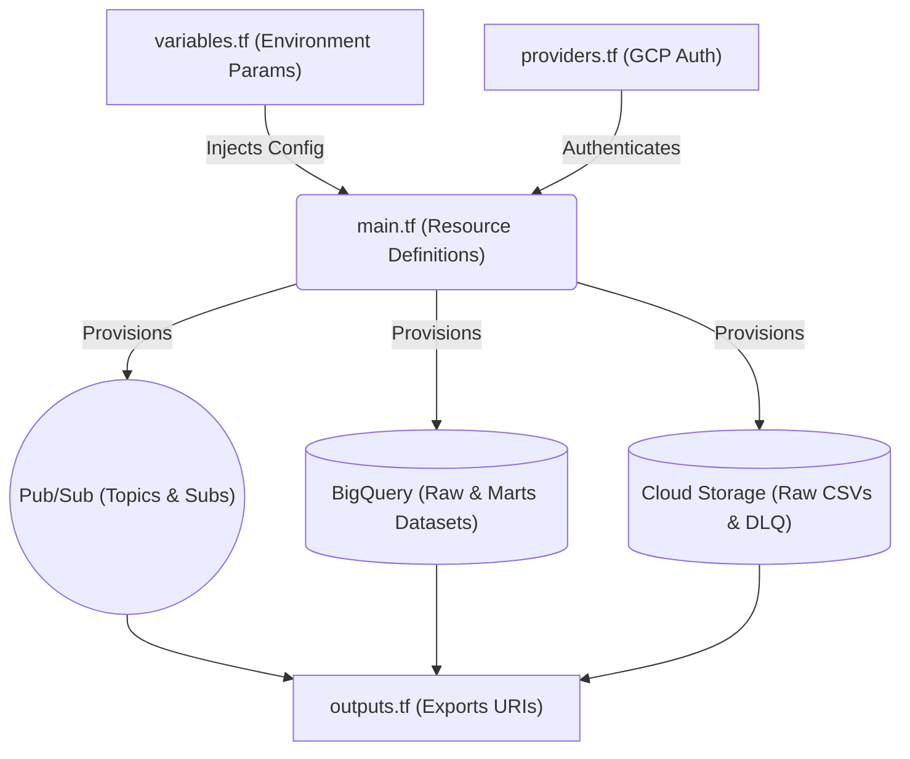

# Infrastructure as Code (IaC) Layer

## 📌 Enterprise Purpose
This module contains the **Terraform** configurations necessary to bootstrap the entire GCP environment from scratch. By using IaC, we eliminate manual GUI configurations, prevent configuration drift, and ensure that Development, Staging, and Production environments are 100% identical and reproducible.

## 🔄 Resource Provisioning Flow


## 📦 Required Software & Dependencies
- **Terraform CLI:** (v1.5+) Required to execute initialization and application.
- **Google Cloud SDK (gcloud):** Required for authentication (`gcloud auth application-default login`).
- **Provider:** `hashicorp/google` (v5.0+).

## 📄 File Breakdown
| File | Functionality |
|---|---|
| `main.tf` | Defines the actual GCP resources: `google_pubsub_topic`, `google_bigquery_dataset`, and `google_storage_bucket`. |
| `variables.tf` | Extracts hardcoded values (like `project_id`, `region`, `env`) allowing the same code to deploy to different environments. |
| `outputs.tf` | Outputs critical connection strings (e.g., Bucket URLs, Topic Names) needed by the Python Data Generator. |
| `providers.tf` | Instructs Terraform to download the GCP API plugins and sets the authentication context. |

## 🚀 Execution Instructions
To deploy the foundational infrastructure:
```bash
# 1. Download provider plugins
terraform init

# 2. Review the execution plan (Dry Run)
terraform plan

# 3. Provision the actual GCP resources
terraform apply -auto-approve
```
