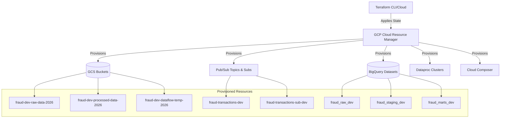

# Infrastructure as Code (Terraform)

## Purpose

The `infrastructure` component is responsible for provisioning and managing all Google Cloud Platform (GCP) resources required for the Enterprise GCP Fraud Detection Platform. Using HashiCorp Terraform, this directory defines the state of our cloud environment in a declarative manner. This approach ensures reproducible, consistent, and version-controlled infrastructure across our deployment lifecycle (e.g., dev, staging, prod).

This IaC setup focuses on standing up the core backbone of our Lambda Architecture, encompassing storage (GCS), messaging (Pub/Sub), data warehousing (BigQuery), compute clusters (Dataproc), and streaming engines (Dataflow). It adheres to enterprise security standards, including IAM principle of least privilege and strict service account separations.

## Architecture


```mermaid
graph TD
    TF[Terraform CLI/Cloud] -->|Applies State| GCP[GCP Cloud Resource Manager]
    GCP -->|Provisions| GCS[(GCS Buckets)]
    GCP -->|Provisions| PS[Pub/Sub Topics & Subs]
    GCP -->|Provisions| BQ[(BigQuery Datasets)]
    GCP -->|Provisions| DP[Dataproc Clusters]
    GCP -->|Provisions| CC[Cloud Composer]
    
    subgraph Provisioned Resources
        GCS_RAW[fraud-dev-raw-data-2026]
        GCS_PROC[fraud-dev-processed-data-2026]
        GCS_TMP[fraud-dev-dataflow-temp-2026]
        PS_TOPIC[fraud-transactions-dev]
        PS_SUB[fraud-transactions-sub-dev]
        BQ_RAW[fraud_raw_dev]
        BQ_STG[fraud_staging_dev]
        BQ_MART[fraud_marts_dev]
    end
    
    GCS --> GCS_RAW
    GCS --> GCS_PROC
    GCS --> GCS_TMP
    PS --> PS_TOPIC
    PS --> PS_SUB
    BQ --> BQ_RAW
    BQ --> BQ_STG
    BQ --> BQ_MART
```

## Files

- `main.tf`: The primary entrypoint containing resource definitions (GCS buckets, Pub/Sub, BigQuery datasets, Dataproc, etc.).
- `variables.tf`: Input variable definitions, allowing for modular parameterization across environments (e.g., project IDs, region).
- `outputs.tf`: Output variable definitions, exporting created resource URIs and IDs for downstream use by CI/CD or other modules.
- `providers.tf`: Provider configuration block specifying the GCP provider and version requirements.
- `backend.tf`: State backend configuration (typically a centralized GCS bucket for state locking and shared access).

## Configuration

The environment is configured via `variables.tf`. Essential variables include:
- `project_id`: Target GCP project ID.
- `region`: Primary GCP region (e.g., `us-central1`).
- `environment`: Deployment stage (e.g., `dev`, `prod`).
- `bucket_suffix`: Suffix appended to globally unique buckets like `2026`.

## How It Works

1. **Initialization (`terraform init`)**: Downloads required provider plugins (Google provider) and configures the remote state backend.
2. **Planning (`terraform plan`)**: Analyzes the current state versus the desired state defined in the `.tf` files. Outputs an execution plan detailing additions, modifications, or deletions.
3. **Execution (`terraform apply`)**: Executes the planned changes against the GCP API. It creates Pub/Sub topics (`fraud-transactions-dev`), subscriptions, required GCS buckets for raw/processed data, and BigQuery datasets for staging and marts.
4. **State Management**: Updates the remote `terraform.tfstate` file, securing the single source of truth for the environment.

## Dependencies

- **Terraform CLI**: Version 1.3.0 or higher.
- **GCP Authentication**: Valid Google Cloud credentials with sufficient permissions (e.g., Editor, Storage Admin, BigQuery Admin, Pub/Sub Admin) exposed via `GOOGLE_APPLICATION_CREDENTIALS`.

## Commands

```bash
# Initialize working directory
terraform init

# Validate configuration syntax
terraform validate

# Review the execution plan
terraform plan -var-file="dev.tfvars"

# Apply changes to the infrastructure
terraform apply -var-file="dev.tfvars"

# Destroy resources (use with caution!)
terraform destroy -var-file="dev.tfvars"
```

## Integration Points

- **CI/CD (.github/workflows)**: Terraform is executed automatically by GitHub Actions pipelines upon pushes to main or environment branches.
- **Streaming & Batch Pipelines**: These pipelines rely on the exact Pub/Sub topics and GCS buckets provisioned by this infrastructure.
- **dbt Transformations**: BigQuery datasets provisioned here serve as the targets for all dbt models.
