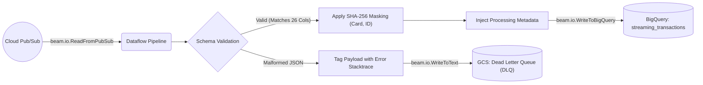

# Real-Time Streaming Pipeline (Speed Layer)

## 📌 Enterprise Purpose
This module represents the "Speed Layer" of the Lambda Architecture. Built on **Apache Beam** and executed serverlessly on **Cloud Dataflow**, it ingests infinite streams of JSON transactions from Pub/Sub. Its primary enterprise duty is to enforce the schema, apply cryptographic hashing (`SHA-256`) to mask PII in real-time, and route processing failures to a Dead Letter Queue to prevent pipeline crashes.

## 🔄 Streaming Architecture & Exception Handling


## 📦 Required Software & Dependencies
- `pip install apache-beam[gcp]` (Contains the core framework and GCP I/O connectors).
- **Google Cloud SDK (gcloud):** Required to authenticate and submit the job to the fully managed Dataflow runner.

## 📄 Pipeline Stages (File: `fraud_streaming_pipeline.py`)
1. **Ingestion:** Connects to the Pub/Sub subscription provisioned by Terraform.
2. **Validation `DoFn`:** Ensures every payload matches the expected schema. Drops bad data.
3. **Masking `DoFn`:** Uses standard Python `hashlib` to anonymize `card_number` and `customer_id`.
4. **Sinking:** Writes to the BigQuery Landing Zone using `CREATE_IF_NEEDED` and `APPEND` dispositions.

## 🚀 Deployment Instructions
To submit the pipeline to Google Cloud Dataflow (Serverless):
```bash
python fraud_streaming_pipeline.py \
  --project=fraud-detection-de-project \
  --region=asia-south1 \
  --temp_location=gs://fraud-dev-dataflow-temp/ \
  --runner=DataflowRunner
```
