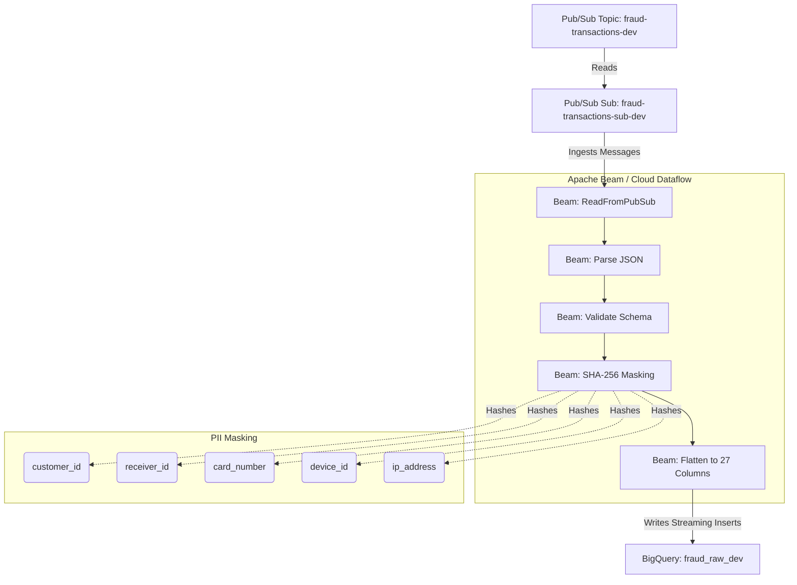

# Streaming Ingestion Pipeline (Dataflow / Apache Beam)

## Purpose

The `streaming_pipeline` component implements the real-time processing layer of our Lambda Architecture. Built with Apache Beam and executed on Google Cloud Dataflow, it is responsible for ingesting live transaction events from Pub/Sub, applying immediate transformations, performing critical PII masking, and writing the cleansed records directly into BigQuery.

This pipeline ensures that near real-time data is available in the data warehouse (typically within seconds of the transaction occurring), enabling immediate fraud detection analytics and live dashboard updates.

## Architecture


```mermaid
graph TD
    PS[Pub/Sub Topic: fraud-transactions-dev] -->|Reads| SUB[Pub/Sub Sub: fraud-transactions-sub-dev]
    SUB -->|Ingests Messages| BEAM_READ[Beam: ReadFromPubSub]
    
    subgraph Apache Beam / Cloud Dataflow
        BEAM_READ --> PARSE[Beam: Parse JSON]
        PARSE --> VALIDATE[Beam: Validate Schema]
        VALIDATE --> MASK[Beam: SHA-256 Masking]
        MASK --> FLATTEN[Beam: Flatten to 27 Columns]
    end
    
    FLATTEN -->|Writes Streaming Inserts| BQ[BigQuery: fraud_raw_dev]
    
    subgraph PII Masking
        MASK -.->|Hashes| CID(customer_id)
        MASK -.->|Hashes| RID(receiver_id)
        MASK -.->|Hashes| CARD(card_number)
        MASK -.->|Hashes| DEV(device_id)
        MASK -.->|Hashes| IP(ip_address)
    end
```

## Files

- `fraud_streaming_pipeline.py`: The main Apache Beam pipeline script. It defines the DAG of transforms (DoFns) connecting the Pub/Sub source to the BigQuery sink.
- `requirements.txt`: Python package dependencies required by the Dataflow workers.
- `utils/`: Helper modules for specific transformations, such as the PII hashing logic.

## Configuration

Pipeline options are passed at execution time. Key parameters include:
- `--input_subscription`: `projects/PROJECT_ID/subscriptions/fraud-transactions-sub-dev`
- `--output_table`: `PROJECT_ID:fraud_raw_dev.streaming_transactions`
- `--temp_location`: `gs://fraud-dev-dataflow-temp-2026/temp`
- `--streaming`: Flag enabling streaming execution mode.

## How It Works

1. **Ingestion**: The pipeline continuously reads raw JSON messages from the `fraud-transactions-sub-dev` Pub/Sub subscription.
2. **Parsing & Validation**: Messages are deserialized from bytes to Python dictionaries. Malformed records are diverted to a Dead Letter Queue (DLQ).
3. **PII Masking**: A custom `DoFn` applies a secure SHA-256 hash to sensitive fields: `customer_id`, `receiver_id`, `card_number`, `device_id`, and `ip_address`. This is a strict compliance requirement.
4. **Schema Alignment**: Nested JSON fields are flattened, ensuring the record perfectly matches the target 27-column BigQuery schema.
5. **Sink**: The transformed records are streamed into the `fraud_raw_dev` BigQuery dataset using the Storage Write API for high throughput and low latency.

## Dependencies

- **Python 3.9+**
- **apache-beam[gcp]**: Core framework for defining and running the pipeline on Dataflow.
- **google-cloud-pubsub & google-cloud-bigquery**: For native GCP IO connectors.

## Commands

```bash
# Run locally (DirectRunner) for testing
python fraud_streaming_pipeline.py   --runner DirectRunner   --input_subscription projects/my-project/subscriptions/my-sub   --output_table my-project:fraud_raw_dev.streaming_test

# Deploy to Cloud Dataflow
python fraud_streaming_pipeline.py   --runner DataflowRunner   --project my-project   --region us-central1   --temp_location gs://fraud-dev-dataflow-temp-2026/temp   --input_subscription projects/my-project/subscriptions/fraud-transactions-sub-dev   --output_table my-project:fraud_raw_dev.transactions   --streaming
```

## Integration Points

- **Data Generator**: Consumes messages pushed to the upstream Pub/Sub topic by the generator.
- **Infrastructure**: Relies on the Dataflow temporary GCS bucket, Pub/Sub configurations, and BigQuery datasets.
- **dbt Transformations**: Serves as the real-time source for downstream dbt models in the staging layer.
