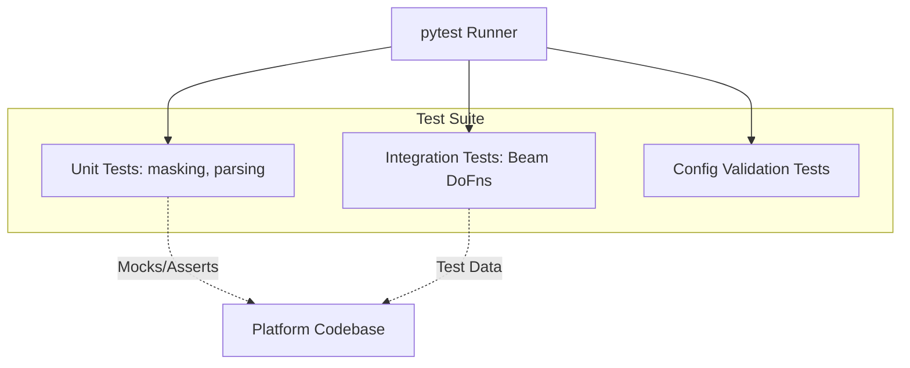

# Platform Testing Suite (pytest)

## Purpose

The `tests` directory contains the automated testing framework for the platform, ensuring code quality, logic validation, and regression prevention. Utilizing `pytest`, this suite includes unit tests for individual Python functions (like PII masking algorithms), integration tests for pipeline components, and configuration validation.

Robust testing is critical for maintaining the integrity of the fraud detection logic and ensuring PII masking compliance before any code is deployed to production.

## Architecture



## Files

- `conftest.py`: Shared pytest fixtures, such as mock transaction payloads or mock GCP client initializations.
- `test_pii_masking.py`: Strict validation of the SHA-256 hashing logic for `customer_id`, `receiver_id`, `card_number`, `device_id`, and `ip_address` to guarantee compliance.
- `test_streaming_pipeline.py`: Uses Apache Beam's `TestPipeline` and `assert_that` to validate data transformations without needing a live GCP environment.
- `test_data_generator.py`: Ensures the Faker logic adheres to configured fraud ratios and schema requirements.

## Configuration

Test behaviors are configured via `pytest.ini` (e.g., setting markers, logging levels, and test path discovery).

## How It Works

1. **Discovery**: `pytest` automatically discovers all files matching `test_*.py`.
2. **Fixtures**: `conftest.py` provides necessary context, setting up mock inputs or environment variables.
3. **Execution**: Tests run, asserting that function outputs match expected results (e.g., verifying a known string hashes to a specific SHA-256 value).
4. **Reporting**: Outputs a clear pass/fail report and coverage metrics.

## Dependencies

- **pytest**: Core testing framework.
- **pytest-cov**: For measuring code coverage.
- **pytest-mock**: For mocking external GCP API calls.
- **apache-beam[test]**: For streaming pipeline unit tests.

## Commands

```bash
# Run all tests
pytest

# Run tests with verbose output
pytest -v

# Run tests and generate coverage report
pytest --cov=../ --cov-report=html

# Run specific test file
pytest test_pii_masking.py
```

## Integration Points

- **CI/CD (.github/workflows)**: The test suite acts as a gating mechanism in GitHub Actions; pull requests cannot be merged if any tests fail.
